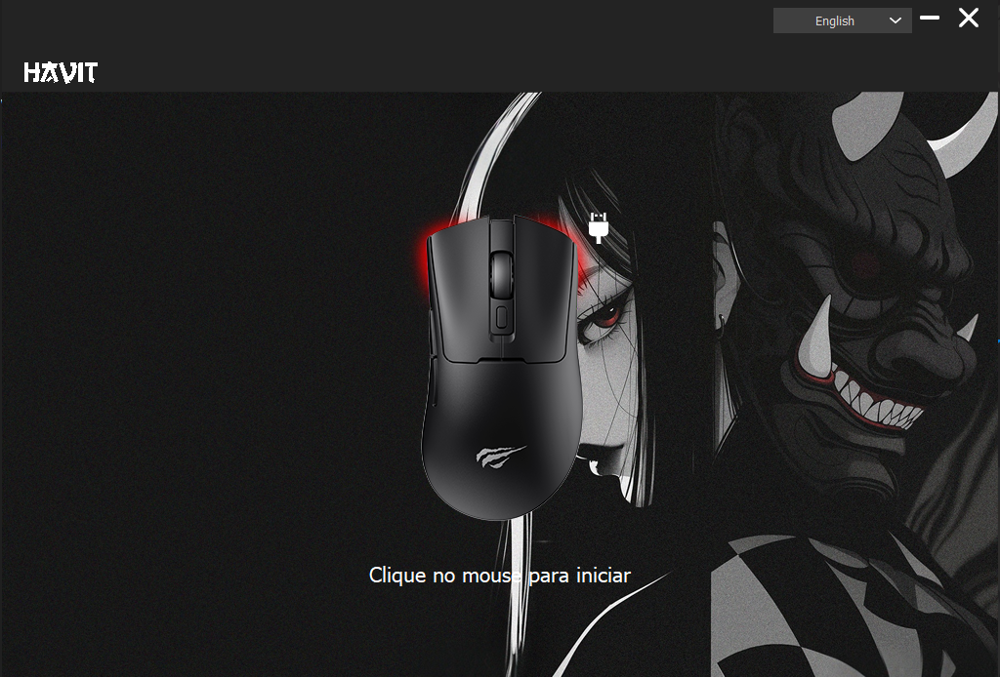
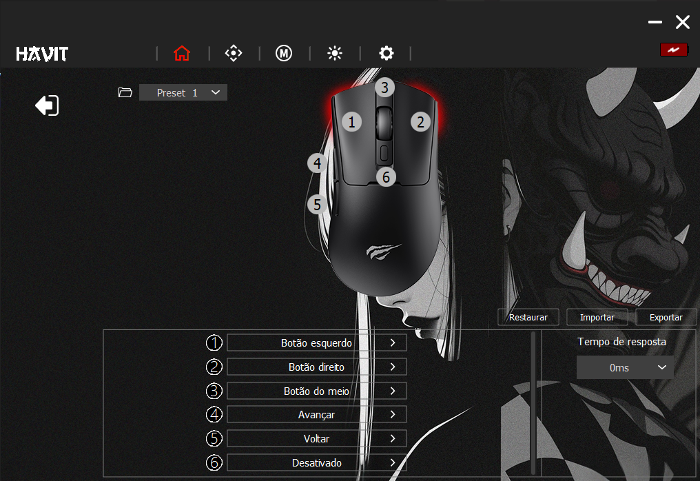
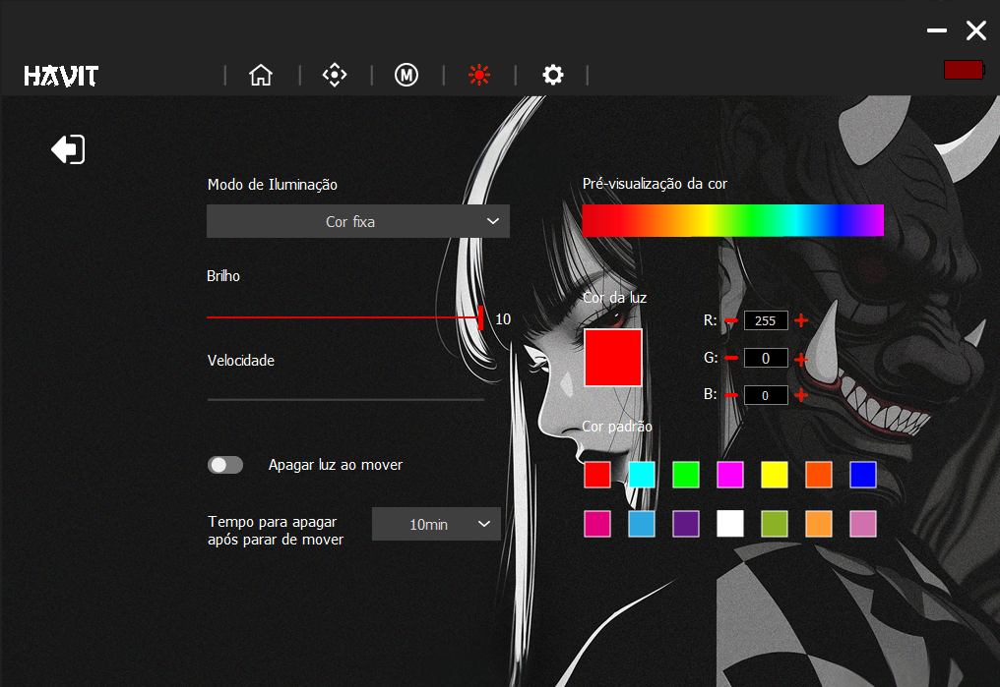

# MS966SE Theme (PT-BR)

Tema customizado para o software do mouse **MS966SE Gaming Mouse**.

O objetivo deste projeto é substituir o tema original do aplicativo, que possui imagens de baixa qualidade e uma interface visualmente ultrapassada.

## Recursos

- Interface mais limpa e moderna
- PNGs em melhor qualidade
- Tradução completa para Português Brasil (PT-BR)
- Melhor aparência geral do software
- Ajustes visuais em telas e menus

---

# Preview

## Tela inicial


## Configurações do mouse


## Tela interna / RGB / Macro


---

# Instalação

1. Baixe este repositório:
   - Clique em `Code > Download ZIP`
   - Ou clone utilizando Git

2. Extraia os arquivos.

3. Copie a pasta `sys64` para:

```txt
C:\Program Files\MS966SE Gaming Mouse
```

4. Substitua os arquivos quando solicitado.

5. Abra o software normalmente.

---

# Observações

- É recomendado fazer backup da pasta original antes da substituição.
- O tema foi desenvolvido para o software padrão do mouse MS966SE.
- Algumas versões diferentes do software podem apresentar incompatibilidades.

---

# Melhorias realizadas

- Tradução completa para PT-BR
- Recriação de elementos visuais
- PNGs com maior qualidade
- Ajustes na interface
- Melhor legibilidade dos menus
- Visual menos poluído

---

# Official Driver Download

Official Havit driver download page:

:contentReference[oaicite:0]{index=0}

---

# Créditos

Desenvolvido por Rodrigo para melhorar a experiência de uso do software MS966SE.
